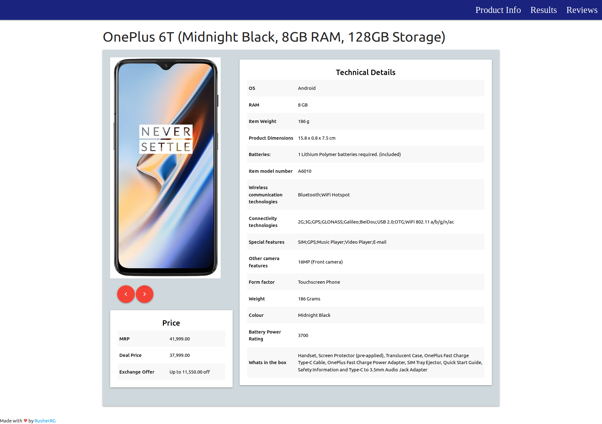

# Course5-Amazon Product Reviews Sentiment Analysis

## About

- The Amazon product details and reviews page for OnePlus 6T was scraped using selenium and beutifulsoup. 
- All the reviews scraped were classified into 5 categories namely Battery Life, Value for Money, Fingerprint, Picture and Sound Quality.  
- Sentiment Analysis of the reviews was performed further classifying them as positive, negative and neutral.
- A dashboard was also made to visualize the output of the analysis.

## Demo

  

  

  

## Future Plans

- [ ] Improve text preprossing
- [ ] Improve the confidence of the sentiment analysis
- [ ] Analyze the reviews of other products

------------------------------------------
## Contributing
Open to `enhancements` & `bug-fixes`

## Note
The project was made as part of the assignment given by Course5 Team.
